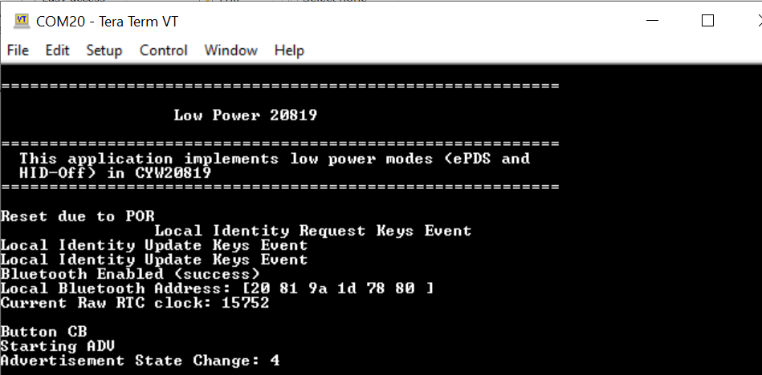

# CYW20819/CYW20820 – BTSDK low power

This example demonstrates low-power modes on CYW20819 and CYW20820 using ModusToolbox&trade;.

[View this README on GitHub.](https://github.com/Infineon/mtb-example-btsdk-low-power-20819)

[Provide feedback on this code example.](https://cypress.co1.qualtrics.com/jfe/form/SV_1NTns53sK2yiljn?Q_EED=eyJVbmlxdWUgRG9jIElkIjoiQ0UyMzY2NjQiLCJTcGVjIE51bWJlciI6IjAwMi0zNjY2NCIsIkRvYyBUaXRsZSI6IkNZVzIwODE5L0NZVzIwODIwIOKAkyBCVFNESyBsb3cgcG93ZXIiLCJyaWQiOiJhbW1sIiwiRG9jIHZlcnNpb24iOiIxLjAuMCIsIkRvYyBMYW5ndWFnZSI6IkVuZ2xpc2giLCJEb2MgRGl2aXNpb24iOiJNQ0QiLCJEb2MgQlUiOiJJQ1ciLCJEb2MgRmFtaWx5IjoiQlRBQkxFIn0=)

## Requirements

- [ModusToolbox&trade; software](https://www.infineon.com/cms/en/design-support/tools/sdk/modustoolbox-software/) v2.4 or later (tested with v2.4)
- Board support package (BSP) minimum required version for :
   - [CYW920819M2EVB-01](http://www.infineon.com/cyw920819m2evb-01) : v4.0.0
   - [CYW920820M2EVB-01](http://www.infineon.com/cyw920820m2evb-01) : v3.0.0
- Programming language: C

- Associated parts:  [AIROC™ CYW20819 Bluetooth® & Bluetooth® LE system on chip](https://www.infineon.com/cms/en/product/wireless-connectivity/airoc-bluetooth-le-bluetooth-multiprotocol/cyw20819/), [AIROC™ CYW20820 Bluetooth® & Bluetooth® LE system on chip](https://www.infineon.com/cms/en/product/wireless-connectivity/airoc-bluetooth-le-bluetooth-multiprotocol/cyw20820/)

## Supported toolchains (make variable 'TOOLCHAIN')

- GNU Arm® Embedded Compiler v10.3.1 (`GCC_ARM`) - Default value of `TOOLCHAIN`

## Supported kits (make variable 'TARGET')
- [CYW920820M2EVB-01 evaluation kit](http://www.infineon.com/cyw920820m2evb-01) (`CYW920820M2EVB-01`) - Default value of `TARGET`
- [CYW920819M2EVB-01 evaluation kit](http://www.infineon.com/cyw920819m2evb-01) (`CYW920819M2EVB-01`)

## Hardware setup

This example uses the board's default configuration. See the kit user guide to ensure that the board is configured correctly.

## Software setup

This code example consists of two parts: a client and a server. For the client, download and install the LightBlue Connect App for [iOS](https://apps.apple.com/us/app/lightblue/id557428110) or [Android](https://play.google.com/store/apps/details?id=com.punchthrough.lightblueexplorer&gl=US).

Scan the following QR codes from your mobile phone to download the LightBlue Connect App.


Install a terminal emulator if you don't have one. Instructions in this document use [Tera term](https://ttssh2.osdn.jp/index.html.en). All other required software come bundled with the Eclipse IDE for ModusToolbox&trade; software.

## Using the code example

Create the project and open it using one of the following:

<details><summary><b>In Eclipse IDE for ModusToolbox&trade; software</b></summary>

1. Click the **New Application** link in the **Quick Panel** (or, use **File** > **New** > **ModusToolbox&trade; Application**). This launches the [Project Creator](https://www.infineon.com/ModusToolboxProjectCreator) tool.

2. Pick a kit supported by the code example from the list shown in the **Project Creator - Choose Board Support Package (BSP)** dialog.

   When you select a supported kit, the example is reconfigured automatically to work with the kit. To work with a different supported kit later, use the [Library Manager](https://www.infineon.com/ModusToolboxLibraryManager) to choose the BSP for the supported kit. You can use the Library Manager to select or update the BSP and firmware libraries used in this application. To access the Library Manager, click the link from the **Quick Panel**.

   You can also just start the application creation process again and select a different kit.

   If you want to use the application for a kit not listed here, you may need to update the source files. If the kit does not have the required resources, the application may not work.

3. In the **Project Creator - Select Application** dialog, choose the example by enabling the checkbox.

4. (Optional) Change the suggested **New Application Name**.

5. The **Application(s) Root Path** defaults to the Eclipse workspace which is usually the desired location for the application. If you want to store the application in a different location, you can change the *Application(s) Root Path* value. Applications that share libraries should be in the same root path.

6. Click **Create** to complete the application creation process.

For more details, see the [Eclipse IDE for ModusToolbox&trade; software user guide](https://www.infineon.com/MTBEclipseIDEUserGuide) (locally available at *{ModusToolbox&trade; software install directory}/docs_{version}/mt_ide_user_guide.pdf*).

</details>

<details><summary><b>In command-line interface (CLI)</b></summary>

ModusToolbox&trade; software provides the Project Creator as both a GUI tool and the command line tool, "project-creator-cli". The CLI tool can be used to create applications from a CLI terminal or from within batch files or shell scripts. This tool is available in the *{ModusToolbox&trade; software install directory}/tools_{version}/project-creator/* directory.

Use a CLI terminal to invoke the "project-creator-cli" tool. On Windows, use the command line "modus-shell" program provided in the ModusToolbox&trade; software installation instead of a standard Windows command-line application. This shell provides access to all ModusToolbox&trade; software tools. You can access it by typing `modus-shell` in the search box in the Windows menu. In Linux and macOS, you can use any terminal application.

This tool has the following arguments:

Argument | Description | Required/optional
---------|-------------|-----------
`--board-id` | Defined in the `<id>` field of the [BSP](https://github.com/Infineon?q=bsp-manifest&type=&language=&sort=) manifest | Required
`--app-id`   | Defined in the `<id>` field of the [CE](https://github.com/Infineon?q=ce-manifest&type=&language=&sort=) manifest | Required
`--target-dir`| Specify the directory in which the application is to be created if you prefer not to use the default current working directory | Optional
`--user-app-name`| Specify the name of the application if you prefer to have a name other than the example's default name | Optional

<br>

The following example will clone the "[BTSDK Low Lower](https://github.com/Infineon/mtb-example-btsdk-low-power)" application with the desired name "MyLowPower" configured for the *CYW20819M2EVB-01* BSP into the specified working directory, *C:/mtb_projects*:

   ```
   project-creator-cli --board-id CYW20819M2EVB-01 --app-id mtb-example-btsdk-low-power-20819 --user-app-name MyLowPower --target-dir "C:/mtb_projects"
   ```

**Note:** The project-creator-cli tool uses the `git clone` and `make getlibs` commands to fetch the repository and import the required libraries. For details, see the "Project creator tools" section of the [ModusToolbox&trade; software user guide](https://www.infineon.com/ModusToolboxUserGuide) (locally available at *{ModusToolbox&trade; software install directory}/docs_{version}/mtb_user_guide.pdf*).

</details>

<details><summary><b>In third-party IDEs</b></summary>

Use one of the following options:

- **Use the standalone [Project Creator](https://www.infineon.com/ModusToolboxProjectCreator) tool:**

   1. Launch Project Creator from the Windows Start menu or from *{ModusToolbox&trade; software install directory}/tools_{version}/project-creator/project-creator.exe*.

   2. In the initial **Choose Board Support Package** screen, select the BSP, and click **Next**.

   3. In the **Select Application** screen, select the appropriate IDE from the **Target IDE** drop-down menu.

   4. Click **Create** and follow the instructions printed in the bottom pane to import or open the exported project in the respective IDE.

<br>

- **Use command-line interface (CLI):**

   1. Follow the instructions from the **In command-line interface (CLI)** section to create the application, and then import the libraries using the `make getlibs` command.

   2. Export the application to a supported IDE using the `make <ide>` command.

   3. Follow the instructions displayed in the terminal to create or import the application as an IDE project.

For a list of supported IDEs and more details, see the "Exporting to IDEs" section of the [ModusToolbox&trade; software user guide](https://www.infineon.com/dgdl/Infineon-ModusToolbox_2.4_User_Guide-Software-v01_00-EN.pdf?fileId=8ac78c8c7e7124d1017ed97e72563632) (locally available at *{ModusToolbox&trade; software install directory}/docs_{version}/mtb_user_guide.pdf*).

</details>


## Operation

1. Connect the board to your PC using the provided USB cable through the USB connector.

   The USB Serial interface on the kit provides access to the two UART interfaces of the CYW208xx device – WICED HCI UART and WICED Peripheral UART (PUART). The HCI UART is used only for downloading the application code in this code example, while the PUART interface is used for printing the Bluetooth&reg; stack and application trace messages.

2. Open any serial terminal program and select the WICED PUART COM port. Set the serial port parameters to 8N1 and 115200 baud.

3. Program the board using one of the following:

   <details><summary><b>Using Eclipse IDE for ModusToolbox&trade; software</b></summary>

      1. Select the application project in the Project Explorer.

      2. In the **Quick Panel**, scroll down, and click **\<Application Name> Program**.
   </details>

   <details><summary><b>Using CLI</b></summary>

     From the terminal, execute the `make program` command to build and program the application using the default toolchain to the default target. The default toolchain and target are specified in the application's Makefile but you can override those values manually:
      ```
      make program TARGET=<BSP> TOOLCHAIN=<toolchain>
      ```

      Example:
      ```
      make program TARGET=CYW920819M2EVB-01 TOOLCHAIN=GCC_ARM
      ```
   </details>

4. If you want to measure the power consumption, connect an ammeter across J17.1 and J17.2, and a second ammeter across J8.2 and J8.3 to measure current in VDDIO and VBAT domains respectively as shown in Figure 1. If you don’t have two ammeters, measure the current on one domain at a time.

    **Note:** The VPA_BT power domain is not used on this kit and therefore there is no need to measure current on this domain.

   **Figure 1. CYW920819M2EVB-01 Jumpers to measure current**

   

5. Remove jumper J18 to disable thermistor on the evaluation kit.

6. Remove jumper J19 to disable peripherals on the evaluation kit.

7. Program the board with the *btsdk-low-power-20819* application.

    **Note:** If the download fails, it is possible that a previously loaded application is preventing programming. For example, the application may use a custom baud rate that the download process does not detect or the device may be in low-power mode. In that case, it may be necessary to put the board in recovery mode, and then try the programming operation again from the IDE. To enter recovery mode, first, press and hold the recover button (SW1), press and release the reset button (SW2), and then release the recover button (SW1).

8. After the programming is complete, the device will boot up and enter ePDS mode. Wait up to five seconds for the device to enter ePDS mode. Note the current readings from ammeters. These are the current consumed in ePDS mode with no Bluetooth&reg; activity.

   **Figure 2. Bootup log**

   

9. Press switch SW3 on the evaluation kit. The application will get a button callback and it will start advertising.

    Note the current readings on the ammeters. This is the average current in PDS mode with advertisement.

   **Figure 3. Start advertisement log**

   

### Test the connection using the LightBlue Connect mobile app

1. Turn ON Bluetooth&reg; on your Android or iOS device.

2. Launch the LightBlue Connect app.

3. Do the following on the LightBlue Connect app:

   1. Swipe down on the LightBlue Connect app home screen to start scanning for **Bluetooth&reg; Low Power**. Your device appears in the LightBlue Connect app home screen.

   2. Select your device to establish a Bluetooth&reg; LE connection.

   3. Once the device is connected, read the current numbers from the ammeters. These are the currents in ePDS mode with a connection at a connection interval of 100 ms.

   4. Select the **Battery level** characteristic under the **Battery service**.

   5. Select **Subscribe**. CYW20819 will start sending GATT notifications to the mobile device.

   6. Note the current readings on the ammeters. These are the current in ePDS mode with a connection at a connection interval of 100 ms and notifications being sent every 5 seconds.

   7. Disconnect the Bluetooth&reg; connection by pressing SW3 on the kit or by backing out from the mobile app. The device will enter HID-Off mode.

      **Figure 4. Connection, pairing, and connection parameters update messages**

      

      **Figure 5. Disconnection, HID-Off, and restart trace messages**

      


### Test using the CySmart - Bluetooth&reg; LE Test and Debug Tool desktop application on a PC

1. Open the CySmart desktop application and connect to the CY5677 dongle (Central device).

2. Do the following on the CySmart app:

   1. Scan and Connect to the *low_power_20819* device.

   2. When prompted for a connection parameter update, accept it.

   3. After the connection is established, measure the current values. These are the current numbers in ePDS mode with connection at 100 ms interval.

   4. Go to the **Device** tab and click **Discover all attributes**.

   5. Click **Enable all notifications**. The device will start sending notifications every 5 seconds.

   6. Note the current readings on the ammeters. These are the current in ePDS mode with a connection at a connection interval of 100 ms and notifications being sent every 5 seconds.

   7. Click **Disconnect** to disconnect from the Central device. The device will enter HID-Off mode.

## Design and implementation

This code example implements a GATT Server and GAP Peripheral role on CYW20819A1/CYW20820A1. Once the device is powered on, it boots up, configures sleep, initializes the Bluetooth&reg; stack, registers a button interrupt and GATT database, and then enters ePDS mode.

On a button press on switch SW3 on the kit, low-duty advertisement is started, and the device is enters PDS mode. In this mode, the device can connect to a GAP Central device. Upon connection, the device will request connection parameters to be updated (specifically, the connection interval to 100 ms). If the request is accepted, the connection interval changes to 100 ms. The device is in ePDS mode and maintains the connection by sending empty packets. The GAP Central device can now discover all attributes and enable GATT notifications. The peripheral will start sending a dummy battery level value every 5 seconds.

The GATT Server implements a battery service with a Battery Level characteristic. This characteristic is readable and notifiable.
The application code and the Bluetooth&reg; stack runs on the Arm® Cortex®-M4 core of the CYW20819 SoC. The application-level source files for this code example are listed in Table 1.

**Table 1. Code example file structure**

   File name   |   Description
---------------|-----------------
 *low_power_20819.c, low_power_20819.h* | Contains the `application_start()` function, which is the entry point for execution of the user application code after device startup. It also has the sleep callback function used by the PMU. The contents in this file can be referenced to implement low-power modes in other applications
 *app_bt_cfg.c, app_bt_cfg.h* | These files contain the runtime Bluetooth&reg; stack configuration parameters such as device name and advertisement/connection settings.
 *cycfg_bt.h, cycfg_gatt_db.c, cycfg_gatt_db.h* | These files reside in the *GeneratedSource* folder under the application folder. They contain the GATT database information generated using the Bluetooth&reg; Configurator tool.
 *low_power_20819_ble.c* | Contains the Bluetooth&reg; events callback function along with other functions to service Bluetooth&reg; events. It also contains the button callback function.


## Application flow
The following diagrams show the flow of the application code.

**Figure 6. Application flow after bootup**


**Figure 7. Button callback flow**


**Figure 8. Bluetooth&reg; stack management callback flow**


## Current measurements

The instantaneous current consumed by the device is not a steady-state value, but varies depending on the state of the chip that dynamically changes with power mode transitions, making it practically impossible to measure each individual instantaneous current with a handheld multimeter because the duration of these current bursts is very small. Therefore, you should use a multimeter that provides the option to set the *aperture* of the measurement. The aperture is the period **T** during which the multimeter measures the instantaneous currents, integrates them, and then displays the average current for the period T.

For accurate measurements, the aperture of the multimeter should be set to be the same as the advertising or the connection interval. The following tables lists the current values for VBAT and VDDIO in various scenarios. Note that the current is averaged over 10-second intervals.

**Table 2. CYW20819 current in different modes**

State    | ePDS low power enabled VDDIO | ePDS low power enabled VBAT | Low power disabled VDDIO | ePDS low power disabled VBAT
 ---------|--------------------|-------------------|---------------------|--------------------
No Bluetooth&reg; activity              | 1.6 uA  | 7.4 uA     | 47.9 uA             | 0.97 mA
ADV (2.56 seconds interval)             | 2.1 uA  | 13.8 uA    | 47.9 uA             | 0.98 uA
Connection (100 ms connection interval) | 3.2 uA  | 147.1 uA   | 47.9 uA             | 1.02 mA
Notifications (5 s interval)            | 3.3 uA  | 148.3 uA   | 47.9 uA             | 1.02 mA

<br>


**Table 3. CYW20819 current in HID-Off mode**

State   | VDDIO  | VBAT
--------|--------|------
HID-Off | 1.6 uA | 0.6 uA

<br>

**Table 4. CYW20819 current in different connection intervals**

| Connection interval | ePDS enabled VDDIO | ePDS enabled VBAT | ePDS disabled VDDIO | ePDS disabled VBAT |
|---------------------|--------------------|-------------------|---------------------|--------------------|
| 7.5 ms | 22.16 uA | 1.64 mA | 45.22 uA | 1.72 mA |
| 10 ms | 15.8 uA | 1.24 mA | 45.23 uA | 1.42 mA |
| 11.25 ms | 15.1 uA | 1.12 mA | 45.23 uA | 1.37 mA |
| 12.5 ms | 13.3 uA | 1.02 mA | 45.2 uA | 1.37 mA |
| 13.75 ms | 11.4 uA | 0.90 mA | 45.19 uA | 1.29 mA |
| 15 ms | 11.0 uA | 0.85 mA | 45.19 uA | 1.27 mA |
| 25 ms | 7.6 uA | 0.54 mA | 445.2 uA | 1.15 mA |
| 50 | 4.68 uA | 0.28 mA | 45.19 uA | 1.07 mA |
| 100 | 3.2 uA | 0.14 mA | 45.14 uA | 1.02 mA |
| 500 | 1.9 uA | 0.024 mA | 45.21 uA | 0.99 mA |
| 1000 ms | 1.67 uA | 0.010 mA | 45.18 uA | 0.98 |
| 2000 ms | 2.66 uA | 0.009 mA | 45.16 uA | 0.98 mA |
| 4000 ms | 2.65 uA | 0.0085 mA | 45.07 uA | 0.98 mA |

<br>

**Table 5. CYW20820 current in different modes**

| State                                   | ePDS enabled VDDIO | ePDS enabled VBAT | ePDS disabled VDDIO | ePDS disabled VBAT |
|-----------------------------------------|--------------------|-------------------|---------------------|--------------------|
| No Bluetooth&reg; activity              | 2.69 uA             | 9.0 uA            | 48.62 uA             | 0.98 mA            |
| ADV (2.56 seconds interval)             | 2.90 uA             | 19.20 uA           | 45.08 uA             | 0.99 uA            |
| Connection (100 ms connection interval) | 4.20 uA             | 200.5 uA          | 45.11 uA             | 1.02 mA            |
| Notifications (5 s interval)            | 4.58 uA             | 211.4 uA          | 45.23 uA             | 1.02 mA            |

<br>

**Table 6. CYW20820 current in HID-Off mode**

 State   | VDDIO  | VBAT
 ---------|--------|------
 HID-Off | 1.7 uA | 0.6 uA

<br>

**Table 7. CYW20820 Current in Different Connection Intervals**

| Connection Interval | ePDS Enabled VDDIO | ePDS Enabled VBAT | ePDS Disabled VDDIO | ePDS Disabled VBAT |
|---------------------|--------------------|-------------------|---------------------|--------------------|
| 7.5 ms | 19.5 uA | 1.98 mA | 45.22 uA | 1.98 mA |
| 10 ms | 15.2 uA | 1.49 mA | 45.23 uA | 1.63 mA |
| 11.25 ms | 14.0 uA | 1.32 mA | 45.23 uA | 1.51 mA |
| 12.5 ms | 13.1 uA | 1.19 mA | 45.2 uA | 1.37 mA |
| 13.75 ms | 11.3 uA | 1.06 mA | 45.19 uA | 1.29 mA |
| 15 ms | 10.6 uA | 0.98 mA | 45.19 uA | 1.27 mA |
| 25 ms | 7.3 uA | 0.67 mA | 445.2 uA | 1.15 mA |
| 50 | 5.4 uA | 0.37 mA | 45.19 uA | 1.07 mA |
| 100 | 4.2 uA | 0.20 mA | 45.14 uA | 1.02 mA |
| 500 | 2.8 uA | 0.068 mA | 45.21 uA | 0.99 mA |
| 1000 ms | 2.69 uA | 0.052 mA | 45.18 uA | 0.98 |
| 2000 ms | 2.68 uA | 0.020 mA | 45.16 uA | 0.98 mA |
| 4000 ms | 2.57 uA | 0.018 mA | 45.07 uA | 0.98 mA |

Note that these current values also include some leakage current on the board because some GPIOs connected to the onboard components draw current. For accurate current numbers, see the device datasheet.

## Resources and settings

This section explains the ModusToolbox&trade; software resources and their configuration as used in this code example. Note that all the configuration explained in this section has already been done in the code example. Eclipse IDE for ModusToolbox&trade; software stores the configuration settings of the application in the *design.modus* file. This file is used by the graphical configurators, which generate the configuration firmware. This firmware is stored in the application’s *GeneratedSource* folder.

- **Device Configurator:** Used to enable/configure the peripherals and the pins used in the application. See the
[Device Configurator guide](https://www.infineon.com/dgdl/Infineon-ModusToolbox_Device_Configurator_Guide_4-UserManual-v01_00-EN.pdf?fileId=8ac78c8c7d718a49017d99ab297631cb).

- **Bluetooth&reg; Configurator:** Used for generating/modifying the Bluetooth&reg; LE GATT database. See the
[Bluetooth&reg; Configurator guide](https://www.infineon.com/dgdl/Infineon-ModusToolbox_Bluetooth_Configurator_Guide_3-UserManual-v01_00-EN.pdf?fileId=8ac78c8c7d718a49017d99aaf5b231be).

## Reusing this example

This example is designed in a way so that you can use the low-power functions from this example in your own example with minimal changes.

## Related resources

Resources  | Links
-----------| ----------------------------------
Application notes  | [AN225684](https://www.infineon.com/dgdl/Infineon-AN225684_Getting_Started_with_CYW20819-ApplicationNotes-v02_00-EN.PDF?fileId=8ac78c8c7cdc391c017d0d3674d1669d): Getting started with CYW208xx. Describes CYW208xx device and how to build your first ModusToolbox&trade; software project |
Code examples  | [Using ModusToolbox&trade; software](https://github.com/Infineon/Code-Examples-for-ModusToolbox-Software) on GitHub
Device documentation | [CYW20819 device datasheet](https://www.infineon.com/dgdl/Infineon-CYW20819_Ultra_Low_Power_Bluetooth_LE_BR_EDR_Bluetooth_5.0_SoC-AdditionalTechnicalInformation-v07_00-EN.pdf?fileId=8ac78c8c7d0d8da4017d0ee7dba070bf) <br> [CYW20820 device datasheet](https://www.infineon.com/dgdl/Infineon-CYW20820_Ultra_Low_Power_Bluetooth_LE_BR_EDR_Bluetooth_5.0_SoC-AdditionalTechnicalInformation-v06_00-EN.pdf?fileId=8ac78c8c7d0d8da4017d0ee7e70770d1)
Development kits | Visit https://www.infineon.com/cms/en/product/microcontroller/ and use the options in the **Select your kit** section to filter kits by *Product family* or *Features*.
Libraries on GitHub  | [btsdk-drivers](https://github.com/Infineon/btsdk-drivers) – Bluetooth® SDK drivers library <br> [btsdk-mesh](https://github.com/Infineon/btsdk-mesh) - Bluetooth® LE mesh libraries<br> [btsdk-ota](https://github.com/Infineon/btsdk-ota) - Bluetooth® LE OTA libraries<br> [btsdk-ble](https://github.com/Infineon/btsdk-ble) - Bluetooth® LE profile libraries
Tools  | [Eclipse IDE for ModusToolbox&trade; software](https://www.infineon.com/modustoolbox) – ModusToolbox&trade; software is a collection of easy-to-use software and tools enabling rapid development with Infineon MCUs, covering applications from embedded sense and control to wireless and cloud-connected systems using AIROC&trade; Wi-Fi and Bluetooth® connectivity devices. <br> [btsdk-utils](https://github.com/Infineon/btsdk-utils ) -   Bluetooth® SDK utilities <br> [btsdk-peer-apps-ota](https://github.com/Infineon/btsdk-peer-apps-ota) - Bluetooth® LE OTA peer applications <br> [btsdk-host-peer-apps](https://github.com/Infineon/btsdk-host-peer-apps-mesh) - Bluetooth® LE mesh host and peer applications,<br> [btsdk-host-apps-bt-ble](https://github.com/Infineon/btsdk-host-apps-bt-ble) - Bluetooth® and Bluetooth® LE host applications
<br>


## Other resources

Infineon provides a wealth of data at www.infineon.com to help you select the right device, and quickly and effectively integrate it into your design.

## Document history

Document title: CE236664 - *CYW20819/CYW20820* – *BTSDK low power*

 Version | Description of change
 ------- | ---------------------
 1.0.0   | New code example
---------------------------------------------------------

© Cypress Semiconductor Corporation, 2022. This document is the property of Cypress Semiconductor Corporation, an Infineon Technologies company, and its affiliates ("Cypress").  This document, including any software or firmware included or referenced in this document ("Software"), is owned by Cypress under the intellectual property laws and treaties of the United States and other countries worldwide.  Cypress reserves all rights under such laws and treaties and does not, except as specifically stated in this paragraph, grant any license under its patents, copyrights, trademarks, or other intellectual property rights.  If the Software is not accompanied by a license agreement and you do not otherwise have a written agreement with Cypress governing the use of the Software, then Cypress hereby grants you a personal, non-exclusive, nontransferable license (without the right to sublicense) (1) under its copyright rights in the Software (a) for Software provided in source code form, to modify and reproduce the Software solely for use with Cypress hardware products, only internally within your organization, and (b) to distribute the Software in binary code form externally to end users (either directly or indirectly through resellers and distributors), solely for use on Cypress hardware product units, and (2) under those claims of Cypress’s patents that are infringed by the Software (as provided by Cypress, unmodified) to make, use, distribute, and import the Software solely for use with Cypress hardware products.  Any other use, reproduction, modification, translation, or compilation of the Software is prohibited.
<br>
TO THE EXTENT PERMITTED BY APPLICABLE LAW, CYPRESS MAKES NO WARRANTY OF ANY KIND, EXPRESS OR IMPLIED, WITH REGARD TO THIS DOCUMENT OR ANY SOFTWARE OR ACCOMPANYING HARDWARE, INCLUDING, BUT NOT LIMITED TO, THE IMPLIED WARRANTIES OF MERCHANTABILITY AND FITNESS FOR A PARTICULAR PURPOSE.  No computing device can be absolutely secure.  Therefore, despite security measures implemented in Cypress hardware or software products, Cypress shall have no liability arising out of any security breach, such as unauthorized access to or use of a Cypress product. CYPRESS DOES NOT REPRESENT, WARRANT, OR GUARANTEE THAT CYPRESS PRODUCTS, OR SYSTEMS CREATED USING CYPRESS PRODUCTS, WILL BE FREE FROM CORRUPTION, ATTACK, VIRUSES, INTERFERENCE, HACKING, DATA LOSS OR THEFT, OR OTHER SECURITY INTRUSION (collectively, "Security Breach").  Cypress disclaims any liability relating to any Security Breach, and you shall and hereby do release Cypress from any claim, damage, or other liability arising from any Security Breach.  In addition, the products described in these materials may contain design defects or errors known as errata which may cause the product to deviate from published specifications. To the extent permitted by applicable law, Cypress reserves the right to make changes to this document without further notice. Cypress does not assume any liability arising out of the application or use of any product or circuit described in this document. Any information provided in this document, including any sample design information or programming code, is provided only for reference purposes.  It is the responsibility of the user of this document to properly design, program, and test the functionality and safety of any application made of this information and any resulting product.  "High-Risk Device" means any device or system whose failure could cause personal injury, death, or property damage.  Examples of High-Risk Devices are weapons, nuclear installations, surgical implants, and other medical devices.  "Critical Component" means any component of a High-Risk Device whose failure to perform can be reasonably expected to cause, directly or indirectly, the failure of the High-Risk Device, or to affect its safety or effectiveness.  Cypress is not liable, in whole or in part, and you shall and hereby do release Cypress from any claim, damage, or other liability arising from any use of a Cypress product as a Critical Component in a High-Risk Device. You shall indemnify and hold Cypress, including its affiliates, and its directors, officers, employees, agents, distributors, and assigns harmless from and against all claims, costs, damages, and expenses, arising out of any claim, including claims for product liability, personal injury or death, or property damage arising from any use of a Cypress product as a Critical Component in a High-Risk Device. Cypress products are not intended or authorized for use as a Critical Component in any High-Risk Device except to the limited extent that (i) Cypress’s published data sheet for the product explicitly states Cypress has qualified the product for use in a specific High-Risk Device, or (ii) Cypress has given you advance written authorization to use the product as a Critical Component in the specific High-Risk Device and you have signed a separate indemnification agreement.
<br>
Cypress, the Cypress logo, and combinations thereof, WICED, ModusToolbox, PSoC, CapSense, EZ-USB, F-RAM, and Traveo are trademarks or registered trademarks of Cypress or a subsidiary of Cypress in the United States or in other countries. For a more complete list of Cypress trademarks, visit www.infineon.com. Other names and brands may be claimed as property of their respective owners.
